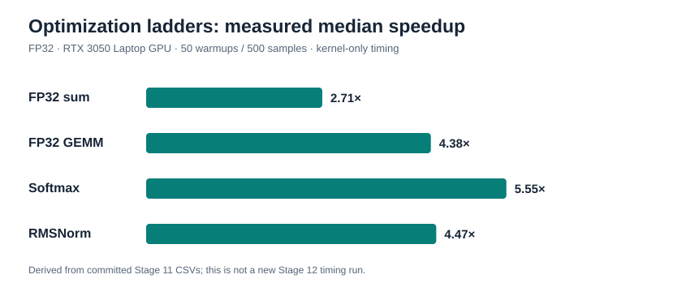

# WarpForge

WarpForge is a CUDA/C++ performance-engineering project spanning measured GPU fundamentals and a small, validated LLaMA-style inference runtime called MiniInfer.

The project is aimed at learning and demonstrating production-minded GPU engineering: numerical correctness, controlled benchmarking, profiler-guided optimization, NVIDIA library integration, and clear explanations of why performance changes.

## Current status

**Stage 12 — portfolio release: complete.**

The deterministic MiniInfer block has correctness-gated native custom, cuBLAS, eager PyTorch CUDA, TensorRT FP32, and TensorRT mixed-FP16 baselines. Stage 11 added a [profiler-backed analysis](docs/performance/profiler_analysis.md). Stage 12 adds a CUDA-free CPU library, warning-clean local Windows builds, 31 passing local CUDA CTests, focused Compute Sanitizer checks, and [hosted CI](https://github.com/aditya9515/WarpForge_/actions/runs/35819598851) passing Ubuntu/Windows CPU jobs and a repository-wide C++/CUDA formatting gate. Local WSL and Linux CUDA remain unvalidated; see the [release notes](docs/release.md).

## Goals

- Build correct CUDA implementations before optimizing them.
- Develop optimization ladders for reduction, GEMM, and Transformer primitives.
- Compare custom kernels honestly with CPU references and NVIDIA libraries.
- Separate kernel-only latency from end-to-end application latency.
- Use Nsight Systems and Nsight Compute to form and test performance hypotheses.
- Integrate the validated primitives into a small inference runtime that fits a 4 GB GPU.
- Preserve the reasoning, measurements, and limitations behind every meaningful optimization.

## Non-goals

- Producing disconnected CUDA tutorial examples.
- Claiming performance without reproducible measurements.
- Attempting to beat cuBLAS or TensorRT as a headline objective.
- Building a general-purpose tensor framework.
- Starting with a large language model or multi-GPU system.
- Optimizing for datacenter GPUs at the expense of the available RTX 3050 Laptop GPU.

## Architecture direction

```text
                          MiniInfer application
                                   |
                         Transformer execution
                                   |
             +---------------------+---------------------+
             |                     |                     |
      Custom CUDA kernels    NVIDIA libraries      CPU/PyTorch
      reduction, GEMM,       cuBLAS and later      references
      softmax, RMSNorm,      selected baselines
      RoPE, activations
             |                     |                     |
             +---------------------+---------------------+
                                   |
                    Validation and benchmark layer
                                   |
                 +-----------------+-----------------+
                 |                 |                 |
            CUDA events      Nsight tools       JSON/CSV data
```

The detailed component boundaries and evolution plan are in [docs/architecture.md](docs/architecture.md).

## Engineering loop

Every optimization follows the same evidence-driven loop:

```text
Correctness -> Baseline -> Profile -> Identify bottleneck
            -> Form hypothesis -> Optimize -> Revalidate
            -> Rebenchmark -> Document the result
```

An optimization is not accepted because it should be faster. It is accepted only after correctness is preserved and the intended effect is measured under the same benchmark methodology.

## Roadmap

| Stage | Milestone |
| --- | --- |
| 0 | Requirements, environment, architecture, and benchmark design |
| 1 | CUDA/C++ project foundation and device discovery |
| 2 | Reusable validation and benchmark infrastructure |
| 3 | CUDA execution and memory-engineering experiments |
| 4 | Parallel reduction optimization ladder |
| 5 | GEMM optimization ladder and cuBLAS baseline |
| 6 | Transformer-oriented CUDA primitives |
| 7 | Kernel fusion and asynchronous execution |
| 8 | Minimal reusable WarpForge GPU runtime |
| 9 | Validated single-block MiniInfer path |
| 10 | NVIDIA library and framework baselines |
| 11 | Professional profiler-backed performance analysis |
| 12 | Testing, portability, CI, packaging, and portfolio hardening |

Stages are implemented one at a time. Completing one stage does not authorize work on the next.

## Portfolio snapshot

WarpForge pairs inspectable CUDA kernels with trusted references, CUDA-event benchmarks, Nsight evidence, and a bounded one-block MiniInfer runtime. The strongest custom FP32 GEMM at 1024³ remains below cuBLAS (51.74% of its throughput); that comparison is a result, not a target to hide. The fixed-shape MiniInfer comparison also includes eager PyTorch CUDA and validated TensorRT FP32/mixed-FP16 engines. All measurements cited here are from the disclosed RTX 3050 Laptop GPU, with timing boundaries specified in their linked reports.

Résumé summary: built a C++17/CUDA kernel library and single-block Transformer inference path, validated each numerical boundary against CPU/PyTorch references, compared custom kernels with cuBLAS/TensorRT, and used CUDA-event benchmarks plus Nsight evidence to explain—not just report—optimization results on a 4 GB laptop GPU.



The [release summary CSV](benchmarks/results/stage12/release_summary.csv) records the exact baseline/optimized medians and source commit for this plot. It is a derived view of Stage 11 results, not a new Stage 12 benchmark. The [profiler analysis](docs/performance/profiler_analysis.md) explains why those changes helped and where MiniInfer still spends time.

## CPU-only build and CI boundary

The default build enables CUDA. For a C++17 validation/statistics build that requires no CUDA Toolkit or GPU, configure with `-DWARPFORGE_ENABLE_CUDA=OFF`:

```sh
cmake -S . -B out/cpu -DWARPFORGE_ENABLE_CUDA=OFF -DWARPFORGE_WARNINGS_AS_ERRORS=ON -DBUILD_TESTING=ON -DCMAKE_BUILD_TYPE=Release
cmake --build out/cpu --config Release
ctest --test-dir out/cpu -C Release --output-on-failure
```

On the audited Windows host, first enter the MSVC 14.44 developer shell below, then use `cmake --preset windows-msvc-cpu`, `cmake --build --preset windows-msvc-cpu`, and `ctest --preset windows-msvc-cpu`. This NMake preset avoids the OneDrive/Ninja stall seen earlier. The hosted [CPU workflow](.github/workflows/cpu.yml) uses Windows and Linux runners for CPU compilation, tests, Python syntax, documentation, plot, and `clang-format-18` checks; it does not run CUDA. GPU validation stays in the local [Windows driver](scripts/test_gpu_windows.ps1) or the manually triggered [self-hosted workflow](.github/workflows/gpu-self-hosted.yml) on a separately configured NVIDIA machine. Details and platform limits are in the [release notes](docs/release.md).

## Build and verify on the audited Windows machine

CUDA 12.6 must use the installed MSVC 14.44 toolset rather than the newer default MSVC 19.51. From PowerShell, open a child command shell with that toolset selected:

```powershell
cmd.exe /k 'call "C:\Program Files (x86)\Microsoft Visual Studio\18\BuildTools\VC\Auxiliary\Build\vcvars64.bat" -vcvars_ver=14.44'
```

Then run these commands in the resulting developer command shell:

```bat
cmake --preset windows-msvc-release
cmake --build --preset windows-msvc-release
ctest --preset windows-msvc-release
build\warpforge-device-info.exe
build\warpforge-benchmark-vector-add.exe --size 1048576 --warmups 10 --iterations 100 --output benchmarks\results\vector_add.json
build\warpforge-benchmark-memory.exe --size 16777216 --rows 2048 --columns 1536 --warmups 10 --iterations 100 --output-dir benchmarks\results\memory
build\warpforge-benchmark-reduction.exe --size 16777216 --block-size 256 --warmups 10 --iterations 100 --output-dir benchmarks\results\reduction
build\warpforge-benchmark-gemm.exe --sizes 256,512,1024,2048 --warmups 10 --iterations 100 --output-dir benchmarks\results\gemm
build\warpforge-benchmark-transformer.exe --rows 4096 --columns 1024 --elements 16777216 --sequence 2048 --heads 8 --head-dim 64 --mask-length 512 --warmups 10 --iterations 100 --output-dir benchmarks\results\stage6
build\warpforge-benchmark-fusion.exe --rows 4096 --columns 1024 --elements 16777216 --pipeline-elements 16777216 --chunks 8 --warmups 10 --iterations 100 --output-dir benchmarks\results\stage7
build\warpforge-miniinfer.exe --fixture-dir benchmarks\fixtures\miniinfer_full --backend all --warmups 50 --iterations 500 --output-dir benchmarks\results\stage10\native
compute-sanitizer --tool memcheck --leak-check full --error-exitcode 99 build\warpforge_runtime_test.exe --skip-allocation-failure
compute-sanitizer --tool memcheck --leak-check full build\warpforge_miniinfer_test.exe tests\fixtures\miniinfer_small
```

The preset targets `sm_86` by default and passes `--use-local-env` to `nvcc` so it reuses the deliberately selected MSVC environment. Other NVIDIA architectures remain configurable with `-DCMAKE_CUDA_ARCHITECTURES=<architectures>`.

The approved Stage 10 Python/TensorRT environment is repository-local and ignored. Its exact packages, ONNX/engine build commands, validation-first sequence, and `trtexec` timing commands are documented in [the baseline report](docs/performance/baselines.md#reproduction).

## Build targets

| Target | Responsibility |
| --- | --- |
| `WarpForge::warpforge` | Static library containing shared CUDA runtime functionality |
| `warpforge_device_info` | Reports CUDA versions and useful properties for every detected device |
| `warpforge_benchmark_vector_add` | Runs CPU reference, CUDA validation, event timing, statistics, and JSON export |
| `warpforge_benchmark_memory` | Runs Stage 3 block, stride, transpose, transfer, and stream experiments |
| `warpforge_benchmark_reduction` | Validates and measures Stage 4 sum/maximum reduction variants |
| `warpforge_benchmark_gemm` | Validates and measures custom FP32/FP16 GEMM and matched cuBLAS baselines |
| `warpforge_benchmark_transformer` | Validates and measures Stage 6 Transformer-oriented FP32 kernels |
| `warpforge_benchmark_fusion` | Compares separate/fused Transformer paths and single/two-stream pinned pipelines |
| `warpforge_miniinfer` | Validates every named block intermediate and measures custom/cuBLAS MiniInfer paths |
| `warpforge_cuda_smoke` | Validates runtime initialization and basic device discovery through CTest |
| `warpforge_runtime_test` | Validates move-only ownership, async copies, workspace reuse, tensor views, and GEMM backend dispatch |

`CUDA_CHECK(...)` evaluates a CUDA runtime call once and throws an exception containing the expression, source location, error name, numeric code, and description. A successful kernel launch will only show that work was accepted for execution; later stages must check launch errors immediately and use synchronization at validation boundaries to surface asynchronous execution failures. The helper deliberately does not synchronize every call because unconditional device-wide synchronization would distort performance-sensitive paths.

## Measured development platform

The Stage 0 audit was performed on 2026-09-20.

| Component | Observed value |
| --- | --- |
| Operating system | Windows 11, build 26200.9457 |
| GPU | NVIDIA GeForce RTX 3050 Laptop GPU |
| Compute capability | 8.6 (`sm_86`) |
| Dedicated VRAM | 4096 MiB |
| NVIDIA driver | 616.92 |
| Driver-reported CUDA capability | 13.4 |
| CUDA Toolkit / `nvcc` | 12.6 / 12.6.85 |
| Nsight Compute | 2024.3.2 |
| Nsight Systems | 2024.5.1 and 2025.6.3, installed but not on `PATH` |
| Compute Sanitizer | 2024.3.0 |
| MSVC | 19.44.35228 and 19.51.36256 installed; `cl` not on the normal PowerShell `PATH` |
| CMake | 4.3.1-msvc1 bundled with Visual Studio; not available on `PATH` |
| Git | 2.53.0.windows.2 |
| Stage 10 Python | CPython 3.12.13, NumPy 2.3.3, PyTorch 2.14.0+cu126, ONNX 1.16.0 |
| TensorRT | 10.7.0.23 Windows CUDA 12.6 SDK and `trtexec` |

The CUDA Toolkit version and the maximum CUDA version reported by the driver are different concepts. Builds in this project are currently governed by the installed CUDA 12.6 Toolkit.

See [docs/requirements.md](docs/requirements.md) for compatibility findings and Stage 1 prerequisites, and [docs/benchmark_methodology.md](docs/benchmark_methodology.md) for the measurement contract.

## Documentation

- [Requirements and environment](docs/requirements.md)
- [System architecture](docs/architecture.md)
- [Benchmark and validation methodology](docs/benchmark_methodology.md)
- [VectorAdd validation baseline](docs/performance/vector_add.md)
- [CUDA execution and memory engineering](docs/performance/memory.md)
- [Parallel reduction engine](docs/performance/reduction.md)
- [GEMM optimization ladder](docs/performance/gemm.md)
- [Transformer-oriented CUDA kernels](docs/performance/transformer_kernels.md)
- [Fusion and asynchronous execution](docs/performance/fusion.md)
- [WarpForge GPU runtime](docs/performance/runtime.md)
- [MiniInfer single Transformer block](docs/performance/miniinfer.md)
- [MiniInfer library and framework baselines](docs/performance/baselines.md)
- [Profiler-backed performance analysis](docs/performance/profiler_analysis.md)
- [Release, CI, and portability notes](docs/release.md)
- [Benchmark JSON schema v1](benchmarks/schema/v1.json)

## Stage 0 completion report

### Stage 0 summary

The local hardware, CUDA stack, compiler installations, profiling tools, and repository state were audited. Project scope, architecture, numerical-validation policy, benchmark methodology, hardware limits, non-goals, and the staged roadmap are now documented.

### Files created or modified

- `README.md`
- `docs/requirements.md`
- `docs/architecture.md`
- `docs/benchmark_methodology.md`

### Commands executed

- `nvidia-smi` and targeted `nvidia-smi --query-gpu` queries
- `nvcc --version`
- `cmake --version` availability check and bundled CMake version check
- `cl` availability and installed compiler version checks
- `git --version`, repository status, remote, branch, and history checks
- `ncu --version`
- `nsys --version` using the installed executable paths
- `compute-sanitizer --version`
- Visual Studio installation and CUDA host-compiler guard inspection

### Observed toolchain

The primary GPU, CUDA Toolkit, Nsight Compute, Compute Sanitizer, and Git installations are available. CMake 4.3.1-msvc1 is bundled with Visual Studio but not discoverable through the current `PATH`. MSVC is installed but requires an initialized developer environment, and the installed 19.51 toolset exceeds CUDA 12.6's local host-compiler version guard. Nsight Systems is installed but not discoverable through the current `PATH`.

### Decisions

- Target C++17 and configurable CUDA architectures, with `sm_86` as the primary local target.
- Select the MSVC 14.44/19.44 toolset for CUDA 12.6 rather than bypassing the compiler compatibility check.
- Treat CPU implementations, PyTorch, cuBLAS, or another justified NVIDIA library as correctness references according to the operation.
- Keep allocation and transfers out of kernel-only timing unless they are the explicit subject of the experiment.
- Defer all source code, build files, dependency installation, and benchmark outputs to their designated stages.

### Problems

- The bundled CMake executable must be invoked explicitly or made discoverable before Stage 1 configures the project.
- The Stage 1 shell or build configuration must explicitly activate/select MSVC 14.44.
- Nsight Systems needs an explicit executable path or a deliberate `PATH` configuration before command-line profiling.
- Linux and WSL2 portability have not yet been validated.

### Definition-of-Done status

**PASS.** The environment is understood, the architecture and benchmark philosophy are documented, the repository is initialized, and the project scope is clear. Missing build prerequisites are recorded as Stage 1 entry conditions rather than hidden or worked around.

## Stage 1 completion report

### Implemented

- CMake C++17/CUDA project with a configurable architecture and local `sm_86` default
- `warpforge` static library and `WarpForge::warpforge` alias
- Checked CUDA runtime-call utility
- CUDA driver/runtime version and device-property discovery
- `warpforge-device-info` command-line application
- CTest-integrated CUDA runtime smoke test
- Reproducible Windows release configure, build, and test presets

### Files

- Root CMake configuration, Windows preset, and generated-file ignore rules
- Public runtime headers under `include/warpforge/`
- Device discovery implementation under `src/runtime/`
- Device-information application under `apps/device_info/`
- CUDA smoke test under `tests/cuda/`
- Stage 1 status and toolchain documentation updates

### Tests

- Release configuration identifies CUDA 12.6.85 and MSVC 19.44.35228.
- All library, application, and test targets compile and link.
- `cuda.runtime_smoke` passes through CTest on the RTX 3050 Laptop GPU.
- `warpforge-device-info` executes successfully and reports one CUDA device.

### Benchmarks

None. Benchmark infrastructure belongs to Stage 2, and Stage 1 reports no timing or throughput claims.

### Measured results

No performance results were measured. Runtime discovery observed one compute-capability 8.6 device with 16 streaming multiprocessors, a warp size of 32, 1024 maximum threads per block, and 4096 MiB of global memory.

### Concepts learned

- `nvcc` compiles CUDA translation units while using MSVC as its host compiler on Windows.
- CUDA runtime calls can fail immediately, while asynchronous execution errors may surface only at a later synchronization boundary.
- Compute capability describes device features; the build architecture selects generated device code.
- Device limits must be queried rather than inferred from the GPU product name.

### Known limitations

- Only the audited Windows/MSVC/CUDA configuration has been built and run.
- The bundled Ninja executable stalled before launching compiler commands in this OneDrive workspace, so the verified Windows preset uses NMake.
- The smoke test validates the runtime and device path but does not launch a computational kernel; the first validation workload belongs to Stage 2.
- No benchmark, numerical-comparison, RAII memory, stream, or event abstraction exists yet.

### Git commit recommendation

`feat(runtime): add CUDA project foundation and device discovery`

### Definition of Done

**PASS.** A fresh Release configuration builds, the device-information executable runs, the CUDA runtime smoke test passes through CTest, and no kernel optimization work has begun.

### Next stage

Stage 2 will add reusable validation, CUDA-event timing, statistical summaries, structured result export, and a CPU-versus-GPU VectorAdd validation workload. It will not begin until explicitly requested.

## Stage 2 completion report

### Implemented

- Reusable FP32 tolerance comparison and detailed error summaries
- CUDA-event kernel-only timing with warmup and per-sample collection
- Min, mean, median, interpolated p95, and sample standard deviation
- Versioned JSON schema and metadata-rich result export
- Deterministic CPU and CUDA VectorAdd pipeline with seed `2027`
- Configurable benchmark CLI and CTest JSON validation

### Files

- Public benchmark, validation, and VectorAdd headers under `include/warpforge/`
- CPU statistics/validation and CUDA timing/kernel implementations under `src/`
- VectorAdd benchmark application and focused CPU/CUDA/Python tests
- JSON schema v1, measured result, methodology updates, and performance journal

### Tests

Six CTest cases pass in Release mode: validation, statistics, CUDA runtime smoke, VectorAdd correctness, benchmark execution, and JSON/schema parsing. VectorAdd coverage includes empty, tiny, warp-boundary, block-boundary, non-divisible, large, and multiple-block-size cases.

### Benchmarks

The report run used 1,048,576 FP32 elements, 256 threads per block, 4,096 blocks, 50 warmups, 500 measured iterations, and seed `2027`. Allocation, input generation, H2D copies, D2H validation, and JSON output were excluded from the CUDA-event interval.

### Measured results

On the RTX 3050 Laptop GPU, code commit `04ff8c9` measured:

- minimum: `0.071680 ms`
- mean: `0.073380 ms`
- median: `0.072704 ms`
- p95: `0.074405 ms`
- sample standard deviation: `0.003197 ms`
- median-derived effective bandwidth: `173.070 GB/s`
- maximum absolute error: `0`

The bandwidth calculation counts two FP32 reads and one FP32 write per element. These values describe this exact run, configuration, and timing boundary; they are not universal GPU specifications.

### Concepts learned

- CUDA events measure elapsed work in a stream without including host allocation or transfer setup.
- A launch-error check validates enqueue/configuration; synchronizing the stop event surfaces asynchronous execution failures.
- Warmup separates one-time initialization from measured steady-state work.
- Median and p95 complement the minimum and mean when individual samples include interference or outliers.

### Known limitations

- Only kernel-only latency is reported; end-to-end timing is intentionally deferred.
- VectorAdd uses a single baseline implementation and has not been profiled or optimized.
- Effective bandwidth is based on logical algorithmic bytes, not measured physical DRAM transactions.
- The JSON schema is parsed and contract-checked without adding a third-party JSON Schema validator.

### Commits

- `04ff8c9 feat(bench): add CUDA event validation pipeline`
- `bench(vector): record Stage 2 validation baseline` (this measured-result and completion-report commit)

### Definition of Done

**PASS.** One command builds, executes the CPU reference and CUDA workload, validates correctness, measures kernel-only latency, reports statistics, and writes schema-versioned JSON.

### Next stage

Stage 3 will run controlled execution and memory experiments covering block sizes, coalescing and stride, transfers, transpose, pinned memory, asynchronous copies, and stream overlap. It will not begin until explicitly requested.

## Stage 3 completion report

### Implemented

- CPU/CUDA SAXPY, custom FP32 copy, strided gather, and naive/tiled transpose
- Controlled 32, 64, 128, 256, and 512-thread block sweeps
- Controlled stride 1, 2, 4, 8, 16, and 32 access experiment
- Pageable/pinned and synchronous/asynchronous transfer comparisons
- Pinned eight-chunk single/two-stream H2D → SAXPY → D2H pipelines
- Per-case schema-v1 JSON, CSV summary, and Nsight Systems trace evidence

### Files

- Public memory-kernel APIs in `include/warpforge/memory.cuh`
- CUDA implementations in `src/kernels/memory/memory.cu`
- Experiment runner in `apps/benchmarks/memory.cpp`
- CUDA correctness and result-contract tests
- 24 measured JSON records, a CSV summary, profiler excerpts, and this performance report

### Tests

All nine Release CTests pass. Stage 3 correctness covers empty and irregular 1D inputs, every requested block size and stride, rectangular/tail-safe transposes, invalid arguments, and explicit two-stream ordering. All 24 report records pass validation with zero failures.

### Benchmarks and measured results

The report run used code commit `3c30bc7`, seed `2027`, 50 warmups, and 500 samples per case on the RTX 3050 Laptop GPU.

- strongest SAXPY result: `1.074176 ms`, `187.424 GB/s` at 256 and 512 threads
- strongest custom-copy result: `0.731136 ms`, `183.574 GB/s` at 128 threads
- stride 1 → stride 8: `163.840 GB/s` → `40.570 GB/s`
- tiled transpose: `0.141312 ms`, `3.007×` faster than naive
- pinned synchronous round trip: `1.649×` faster than pageable synchronous
- two-stream pipeline: `17.707150 ms`, `0.103%` slower than the single-stream result

Nsight Systems used distinct streams but observed serialized H2D, SAXPY, and D2H intervals. No transfer/compute overlap occurred in the representative capture.

### Concepts learned

- Block size has a plateau; maximum threads per block is not automatically fastest.
- Adjacent warp accesses preserve useful bytes per memory transaction, while stride rapidly reduces them.
- Padded shared-memory tiling can make both transpose directions coalesced.
- Pinned memory can improve transfer throughput, but asynchronous calls require independent work and actual device scheduling overlap to help.
- Separate streams express concurrency; a timeline must confirm whether concurrency occurred.

### Known limitations

- Measurements cover one Windows laptop GPU and one shape per experiment family.
- GPU clocks were not locked; endpoint temperature rose from 64 C to 80 C during the report suite.
- Bandwidth values count logical bytes rather than physical DRAM transactions.
- The Nsight report is used for ordering evidence, not headline latency, because instrumentation adds overhead.

### Commits

- `3c30bc7 feat(memory): add CUDA execution experiment suite`
- `bench(memory): record Stage 3 memory experiments` (this evidence and completion-report commit)

### Definition of Done

**PASS.** Every workload is correct; controlled measurements explain block-size, stride, transfer-memory, and transpose effects; and Nsight Systems confirms that the audited two-stream pipeline did not overlap or improve latency.

### Next stage

Stage 4 will implement FP32 sum and maximum reduction variants, arbitrary-length multi-pass reduction, size-aware validation, and Nsight Compute analysis. It will not begin until explicitly requested.

## Stage 4 completion report

### Implemented

- Public sum/maximum operation and five-variant reduction interfaces
- Double-precision CPU sum and FP32 CPU maximum references
- Arbitrary-length non-atomic, multi-pass CUDA reduction with caller-owned ping-pong workspaces
- Naive interleaved, sequential shared-memory, two-elements-per-thread reduced-divergence, unrolled, and warp-shuffle kernels
- Size-aware sum tolerance, deterministic report runner, schema-v1 JSON, and CSV summary
- Nsight Compute comparison of the baseline and strongest implementation

### Files

- Public API in `include/warpforge/reduction.cuh`
- CUDA reference helpers, dispatch, and kernels in `src/kernels/reduction/reduction.cu`
- Benchmark runner in `apps/benchmarks/reduction.cpp`
- CUDA correctness and result-contract tests
- Ten measured JSON records, summary CSV, compact profiler metrics, and the reduction performance journal

### Tests

All 12 Release CTests pass. Reduction coverage includes both operations, every variant, power-of-two and irregular inputs, values below a warp or block, boundary/tail cases, 1,048,576-element arrays, negative-only maximum inputs, block sizes 32–512, invalid arguments, undersized workspace handling, and double-precision CPU accumulation. All ten report JSON records pass the Stage 4 result validator.

### Benchmarks and measured results

The report run used code commit `26ac9d9`, 16,777,216 FP32 elements, 256 threads per block, seed `2027`, 50 warmups, and 500 measured samples per case.

- strongest sum result: warp shuffle at `0.365536 ms`, `183.590 GB/s`, and `2.709×` baseline speedup
- strongest maximum result: warp shuffle at `0.364544 ms`, `184.090 GB/s`, and `2.716×` baseline speedup
- largest sum absolute error: `0.000143409` against a double-precision CPU reference, within the declared size-aware tolerance
- maximum error: exactly `0` for every variant
- neutral step retained: sequential shared memory measured `0.999×` for sum and `0.998×` for maximum

Nsight Compute measured the first-pass DRAM bandwidth rising from `43.264 GB/s` to `169.265 GB/s`, dynamic shared memory falling from 1,024 to 32 bytes per block, and excessive shared-memory wavefronts falling from 6,356,992 to zero. The optimized first pass is memory-bound by the captured evidence.

### Concepts learned

- A deterministic multi-pass tree handles arbitrary lengths without depending on a global floating-point atomic.
- Removing index arithmetic alone is insufficient when memory access and synchronization remain dominant.
- Loading two elements per thread can reduce both grid size and pass count.
- Warp shuffle keeps the final tree in registers and minimizes shared-memory coordination.
- Higher occupancy is not automatically faster: the optimized kernel improved while achieved occupancy decreased.

### Known limitations

- Measurements cover one RTX 3050 Laptop GPU, one large input, and one report block size.
- GPU clocks were not locked, and the report suite ended at an 86 C GPU temperature.
- FP32 reduction order differs from serial double accumulation; compensated summation is not implemented.
- Effective input bandwidth counts original logical bytes, while profiler DRAM bandwidth is a separate physical-traffic measurement.
- Nsight Compute required a UAC-authorized elevated process for performance counters; no driver setting was changed.

### Commits

- `26ac9d9 feat(reduction): add multi-pass optimization ladder`
- `bench(reduction): record Stage 4 optimization results` (this evidence and completion-report commit)

### Definition of Done

**PASS.** Every variant is correct for the tested edge cases, arbitrary lengths use a non-atomic multi-pass path, the strongest sum and maximum variants have reproducible measurements, and the optimization conclusion is supported by Nsight Compute evidence.

### Next stage

Stage 5 will define GEMM semantics and implement the CPU, custom CUDA, mixed-precision/Tensor Core experiment, and cuBLAS comparison ladder. It will not begin until explicitly requested.

## Stage 5 completion report

### Implemented

- Row-major `C = A × B` problem, variant, backend, and dispatch contracts
- Double-accumulation CPU reference for small-shape validation
- Naive, 16 × 16 shared-tiled, 32 × 32 coalesced, and 64 × 64 register-blocked FP32 CUDA kernels
- FP16-input/FP32-accumulation shared-tiled and WMMA Tensor Core kernels
- Matched row-major cuBLAS FP32 and FP16-input baselines
- Deterministic benchmark CLI, schema-v1 JSON, CSV summaries, and Nsight Compute evidence

### Files

- Public GEMM API in `include/warpforge/gemm.cuh`
- Custom and cuBLAS dispatch in `src/kernels/gemm/gemm.cu`
- Benchmark runner in `apps/benchmarks/gemm.cu`
- CUDA correctness and Python result-contract tests
- Forty measured JSON records across the report and 4,096 feasibility run
- Profiler summary and `docs/performance/gemm.md`

### Tests

All 15 Release CTests pass. GEMM tests cover empty, 1 × 1, irregular rectangular, tile-boundary, and WMMA-compatible shapes; all custom variants; both cuBLAS datatypes; invalid pointers; and incompatible WMMA dimensions. All 40 persisted results pass the Stage 5 validator.

### Benchmarks and measured results

The main report uses code commit `f88127e`, seed `2027`, 50 warmups, and 100 samples at sizes 256–2,048. The 4,096 feasibility run uses 5 warmups and 20 samples because of cumulative runtime and thermal load.

- strongest custom FP32 at 1,024: register blocked, `1.094704 ms`, `1,961.7 GFLOP/s`, `48.17%` of cuBLAS
- matched FP32 cuBLAS at 1,024: `0.527360 ms`, `4,072.1 GFLOP/s`
- custom WMMA at 1,024: `0.587264 ms`, `3,656.8 GFLOP/s`, `36.87%` of FP16 cuBLAS
- matched FP16 cuBLAS at 1,024: `0.216512 ms`, `9,918.5 GFLOP/s`
- 4,096 allocations and execution succeeded; register-blocked FP32 reached `1,378.0 GFLOP/s` and WMMA reached `2,011.8 GFLOP/s`
- largest observed custom errors: `8.2016e-05` FP32 and `2.8801e-04` FP16-input, both within declared tolerances

Nsight Compute confirms that register blocking cuts the 1,024 instrumented duration by nearly fivefold, but 56 registers per thread, uncoalesced stores, and shared-memory bank conflicts remain. WMMA activates the tensor pipeline, while low occupancy and long-scoreboard stalls show that its data movement is not yet competitive with cuBLAS.

### Concepts learned

- Shared tiles reduce redundant global loads; coalesced cooperative loading improves them further.
- Register tiling increases arithmetic intensity but trades against register pressure and occupancy.
- Tensor Core instructions alone do not guarantee library-level performance; tile reuse and pipeline design dominate.
- CPU validation is practical for small shapes, while matched cuBLAS is the trusted reference for large matrices.
- Library-relative claims require identical shapes, datatypes, accumulation, and timing boundaries.

### Known limitations

- Only square, contiguous, row-major `alpha=1`, `beta=0`, no-transpose GEMM is implemented.
- Measurements cover one thermally constrained RTX 3050 Laptop GPU; clocks were not locked.
- The main run ended at 83 C and the 4,096 attempt at 84 C, with unrelated background GPU utilization present.
- WMMA requires all dimensions to be multiples of 16.
- No asynchronous tile copy, double buffering, split-K, batching, autotuning, or compensated accumulation is implemented.

### Commits

- `f88127e feat(gemm): add CUDA optimization ladder and cuBLAS dispatch`
- `bench(gemm): record Stage 5 cuBLAS comparisons` (this evidence and completion-report commit)

### Definition of Done

**PASS.** Every implementation is correct under its declared policy; sizes 256–2,048 are measured; 4,096 was safely attempted; custom performance is reported as a percentage of matched cuBLAS; and the naive, strongest FP32, and Tensor Core kernels have profiler-backed explanations without claiming to beat cuBLAS.

### Next stage

Stage 6 will implement and validate Softmax, RMSNorm, RoPE, elementwise operations, SwiGLU support, and causal masking one coherent operation at a time. It will not begin until explicitly requested.

## Stage 6 completion report

### Implemented

- Stable row-wise Softmax with naive, shared-memory block, and warp-shuffle variants
- RMSNorm with naive and cooperative block variants, FP32 device accumulation, and configurable epsilon
- Interleaved-pair RoPE for contiguous `[batch, sequence, heads, head_dimension]` tensors, position offsets, and configurable base
- SiLU, add, multiply, scale, and an explicit two-kernel unfused SwiGLU baseline
- Standalone causal-mask support for contiguous `[batch, heads, query, key]` scores
- Unified deterministic benchmark CLI, schema-v1 JSON records, CSV summary, and result validator

### Files

- Public APIs in `include/warpforge/softmax.cuh`, `rmsnorm.cuh`, `rope.cuh`, `elementwise.cuh`, and `causal_mask.cuh`
- CUDA/CPU implementations under `src/kernels/transformer/`
- Five focused correctness tests under `tests/cuda/`
- Benchmark runner in `apps/benchmarks/transformer.cpp` and Python result-contract test
- Twelve measured JSON records, summary CSV, and `docs/performance/transformer_kernels.md`

### Tests

All 22 Release CTests pass. Stage 6 coverage includes empty and tiny inputs, irregular and boundary widths, extreme Softmax logits, zero/near-zero RMSNorm values, long-position and invalid-dimension RoPE, elementwise and in-place aliasing rules, SwiGLU intermediate restrictions, mask boundaries and offsets, and the benchmark JSON contract.

The initial full-size benchmark correctly failed at RoPE index 1,022,595 under the generic `1e-5` tolerance. Investigation traced the `1.96084e-4` difference to FP32 inverse-frequency rounding amplified at long positions. A 2,048-token regression case and explicit `atol=2.5e-4`, `rtol=1e-5` policy were added before results were accepted; the double-precision CPU reference was not weakened.

### Benchmarks and measured results

The report run used clean code commit `16c59a5`, seed `2027`, 50 warmups, and 500 CUDA-event samples for each of 12 cases on the RTX 3050 Laptop GPU.

- warp Softmax: `0.200672 ms`, `167.210` logical GB/s, `5.353×` faster than naive
- block Softmax: `0.222208 ms`, `151.005` logical GB/s, `4.834×` faster than naive
- block RMSNorm: `0.197504 ms`, `254.839` logical GB/s, `4.599×` faster than naive
- RoPE: `0.053248 ms`, `157.538` logical GB/s, maximum absolute error `1.96084e-4`
- SiLU/add/multiply/scale: `0.736256–1.079072 ms` and `181.839–187.246` logical GB/s
- unfused SwiGLU: `1.828864 ms`, including both launches and intermediate traffic
- causal mask: `0.090112 ms`, `186.182` logical GB/s, exact agreement

Allocation, transfers, CPU reference work, validation, and serialization are excluded from the event interval. Logical bandwidth is not measured DRAM traffic. All 12 JSON records contain 500 samples, zero failures, and code SHA `16c59a5`.

### Concepts learned

- Stable Softmax needs a row maximum before exponentiation even when the performance question is the reduction strategy.
- Cooperative row reductions recover parallelism that one-thread-per-row baselines leave idle.
- Warp shuffles reduce shared-memory coordination while retaining a small cross-warp summary.
- Long-position RoPE needs a precision policy that accounts for FP32 frequency and angle rounding without changing the trusted reference.
- An explicit unfused SwiGLU path establishes the traffic and launch baseline needed to judge Stage 7 fusion honestly.

### Known limitations

- Transformer primitives are FP32 only and were measured at one shape per operation family on one Windows laptop GPU.
- Endpoint temperature rose from 80 C to 83 C; clocks were not locked.
- Softmax/RMSNorm results are measured but not yet supported by focused Nsight Compute captures; that analysis belongs to Stage 11.
- RoPE supports interleaved pairs only, causal masking is standalone, and SwiGLU remains deliberately unfused.
- No attention orchestration, residual fusion, asynchronous pipeline, tensor abstraction, or MiniInfer block has been introduced.

### Commits

- `aa741b5 feat(transformer): add stable Softmax variants`
- `c3a5b67 feat(transformer): add FP32 RMSNorm kernels`
- `eac3e68 feat(transformer): add interleaved RoPE`
- `9ad7108 feat(transformer): add elementwise SwiGLU and causal mask`
- `83be964 feat(transformer): add Stage 6 benchmark suite`
- `16c59a5 test(transformer): cover long-position RoPE precision`
- `bench(transformer): record Stage 6 kernel results` (this evidence and completion-report commit)

### Definition of Done

**PASS.** Every Stage 6 operation has a trusted reference, CUDA implementation, focused tests, a correctness-gated report benchmark, and documented numerical/performance limitations. Twelve report records pass validation with no fabricated or profiler-derived timing claims.

### Next stage

Stage 7 will compare separate and fused residual + RMSNorm and SiLU + multiply paths, account for logical memory traffic, inspect resource pressure, and revisit the pinned two-stream pipeline with explicit events. It will not begin until explicitly requested.

## Stage 7 completion report

### Implemented

- Fused FP32 residual + RMSNorm with an explicit CPU reference and CUDA stream
- Fused FP32 SiLU + multiply (SwiGLU) with exact input/output alias support
- Logical global-memory access accounting for separate and fused graphs
- Pinned one/two-stream eight-chunk H2D → SiLU → D2H pipeline
- Per-stream completion events with no device-wide synchronization
- Unified benchmark/JSON validator plus Nsight Compute and Nsight Systems evidence

### Files

- Public fusion API in `include/warpforge/fusion.cuh`
- Fused CUDA/CPU implementations in `src/kernels/transformer/fusion.cu`
- Correctness and pipeline-ordering coverage in `tests/cuda/fusion_test.cpp`
- Benchmark runner in `apps/benchmarks/fusion.cpp` and Python result validator
- Six report JSON records, summary CSV, compact profiler exports, profiler commands, and `docs/performance/fusion.md`

### Tests

All 25 Release CTests pass. Fusion coverage includes empty, tiny, irregular, boundary, and large shapes; extreme activations; fused and separate paths against the same CPU reference; exact data-input aliasing; invalid weight alias, epsilon, and block size; and an event-completed two-stream pinned pipeline. All six report records pass the Stage 7 JSON contract with zero failures.

### Benchmarks and measured results

The report run used clean code commit `b21cdf0`, seed `2027`, 50 warmups, and 500 samples per case on the RTX 3050 Laptop GPU.

- residual + RMSNorm separate: `0.468992 ms`; fused: `0.317440 ms`, `1.477×` speedup
- SwiGLU separate: `1.808384 ms`; fused: `1.108992 ms`, `1.631×` speedup
- pinned single-stream pipeline: `14.078150 ms`
- pinned two-stream pipeline: `14.680550 ms`, `0.959×` baseline speed, or `4.28%` slower
- maximum residual + RMSNorm error: `7.153e-7`
- maximum SwiGLU error: `1.907e-6`
- maximum pipeline error: `4.768e-7`

Residual fusion reduces logical accesses from six to four per element; SwiGLU fusion reduces them from five to three. Both fused implementations are retained because the measured gains are material and correctness is unchanged.

Nsight Compute reports no register/shared-memory penalty: fused residual + RMSNorm uses 18 registers and 1,024 bytes of dynamic shared memory; fused SwiGLU uses 16 registers and no shared memory. Their DRAM-throughput indicators reach 83.61% and 91.91%, supporting a memory-bound classification.

Nsight Systems observes streams 15 and 16 but zero overlapping intervals across 48 two-stream GPU operations. The minimum gap is 1,728 ns and the device reports one asynchronous copy engine. The two-stream path remains documented but is not preferred.

### Concepts learned

- Fusion is valuable when it removes a real intermediate and launch without creating register or occupancy pressure.
- Logical traffic reduction must be distinguished from profiler-measured physical transactions.
- A correct asynchronous pipeline can still be slower when the hardware and scheduling path do not overlap work.
- Events provide scoped completion without forcing unrelated work through a device-wide synchronization.
- Distinct streams are an expression of possible concurrency, not proof that concurrency happened.

### Known limitations

- Results cover FP32 and one shape per operation on one thermally constrained Windows laptop GPU.
- Endpoint temperature rose from 78 C to 81 C and clocks were not locked.
- The pipeline's SiLU compute is short relative to transfers, and the audited device exposes one asynchronous copy engine.
- No GEMM, attention, masking, or whole-sublayer fusion is implemented.
- Buffer/stream/event ownership is still local and explicit; reusable runtime abstractions belong to Stage 8.

### Commits

- `6d81a8f feat(fusion): add fused Transformer kernels`
- `b21cdf0 feat(fusion): add benchmark and event pipeline`
- `bench(fusion): record Stage 7 profiler evidence` (this evidence and completion-report commit)

### Definition of Done

**PASS.** Both fused operations are correct, faster, and profiler-audited without increased resource pressure. The explicit-event two-stream pipeline is correct, its lack of overlap is confirmed by Nsight Systems, and the negative performance result is retained honestly.

### Next stage

Stage 8 will add transparent move-only `DeviceBuffer`, `CudaStream`, `CudaEvent`, tensor shape/type/view ownership, reusable workspace, and custom/cuBLAS dispatch integration. Existing kernels and benchmarks will migrate to explicit views and streams while preserving measured behavior. It will not begin until explicitly requested.

## Stage 8 completion report

### Implemented

- Move-only `DeviceBuffer<T>`, `CudaStream`, and `CudaEvent` resource owners with `noexcept` destruction, explicit checked reset, release, and native-handle access
- Checked `TensorShape`, FP32/FP16-only `DType`, owning `Tensor`, and non-owning `TensorView`
- Capacity-bounded `DeviceWorkspace` with power-of-two aligned slices, resettable allocation cursor, and storage reuse
- Checked TensorView GEMM dispatch across custom CUDA and cuBLAS backends
- Shared runtime ownership in every existing benchmark without changing kernel timing boundaries

### Files

- Runtime public interface in `include/warpforge/runtime.cuh`
- Runtime implementation in `src/runtime/runtime.cu`
- TensorView GEMM bridge in `include/warpforge/gemm.cuh` and `src/kernels/gemm/gemm.cu`
- Focused runtime coverage in `tests/cuda/runtime_test.cu`
- Migrated benchmark ownership in all six benchmark applications
- Fourteen Stage 8 report JSON records, two summary CSV files, and `docs/performance/runtime.md`

### Tests

All 26 Release CTests pass. Runtime coverage includes move-only type contracts and moved-from state, zero-size resources, checked shape and allocation overflow, a real CUDA allocation failure, async H2D/D2H copies, stream/event operation, typed-view validation, aligned workspace reuse/growth/exhaustion, and custom/cuBLAS GEMM dispatch. Compute Sanitizer 2024.3.0 reports `0 errors` and `0 bytes leaked in 0 allocations` for the focused test with only its intentional out-of-memory case disabled.

### Benchmarks and measured results

Compatibility runs were generated from clean code commit `e8803f2` with seed `2027`, 50 warmups, and 500 samples per case on the RTX 3050 Laptop GPU.

- 1,024-square FP32 GEMM kept the expected ordering: naive `4.822992 ms`, tiled `3.600896 ms`, coalesced `3.185536 ms`, register-blocked `1.188864 ms`, and cuBLAS `0.578560 ms`.
- Register-blocked FP32 reached `48.66%` of cuBLAS, close to the Stage 5 report's `48.17%` ratio despite run-to-run absolute latency variation.
- TensorView-dispatched FP16 GEMM measured tiled `3.821568 ms`, WMMA `0.744448 ms`, and cuBLAS `0.224256 ms`; all paths passed validation.
- Migrated residual + RMSNorm fusion retained a `1.488×` speedup and migrated SwiGLU fusion retained a `1.631×` speedup.
- The two-stream pinned pipeline remained neutral/slower at `0.998×` the single-stream baseline and is still not preferred on this machine.

The runtime creates no hidden work inside measured launch lambdas: TensorViews are constructed before timing, and allocation, copies, validation, and serialization remain outside kernel-only intervals.

### Concepts learned

- RAII can improve failure safety without hiding CUDA handles or synchronization boundaries.
- Move semantics must transfer shape/cursor metadata as well as the device pointer; moved-from objects need coherent observable state.
- An expected `cudaMalloc` failure is a valid normal test but must be omitted from a zero-error sanitizer run because memcheck correctly records the failed CUDA API call.
- Backend dispatch can validate type/shape contracts once and still remain a thin call into the same measured custom or cuBLAS implementation.

### Known limitations

- `Tensor` is contiguous-only and supports FP32/FP16; there are no strides, broadcasting, layouts, autograd, or implicit conversions.
- `DeviceWorkspace` is a single-threaded bump allocator; callers explicitly clear it between reuse epochs.
- Destructors cannot report cleanup failures, so callers that need cleanup diagnostics must use `reset()` before scope exit.
- The public TensorView dispatcher currently covers GEMM. Other kernels retain their already-explicit pointer, dimension, and stream APIs.
- Benchmarks retain local pinned-host ownership because a general pinned-memory abstraction was not part of Stage 8.
- Results cover one Windows laptop GPU with unlocked clocks; the compatibility reruns are not new optimization claims.

### Commits

- `e8803f2 runtime: add transparent CUDA ownership layer`
- `docs(runtime): record Stage 8 validation` (this evidence and completion-report commit)

### Definition of Done

**PASS.** Runtime ownership is move-only, leak-free under Compute Sanitizer, tested across failure and reuse paths, native handles remain visible, both GEMM backends work through checked views, and all existing benchmark workloads pass after migration.

### Next stage

Stage 9 will compose the validated kernels into one deterministic pre-norm LLaMA-style MiniInfer block, add approved PyTorch fixtures, validate named intermediates, reuse runtime allocations/workspace, and support custom/cuBLAS GEMM backends. It will not begin until explicitly requested.

## Stage 9 completion report

### Implemented

- Deterministic FP32 pre-norm LLaMA-style block with the required 1 × 128 × 512 report configuration, 8 heads, head dimension 64, intermediate size 1536, and RMSNorm epsilon `1e-5`
- RMSNorm → Q/K/V → RoPE → scaled causal attention → output/residual → RMSNorm → SwiGLU MLP → output/residual execution
- Selectable custom register-blocked FP32 or cuBLAS projection-GEMM backends
- Dedicated attention score/value CPU references and CUDA kernels with explicit layouts and streams
- Reused device-resident weights, caller input/output tensors, and one aligned activation workspace
- Deterministic PyTorch fixture generation plus manifest/hash validation and all-intermediate observation
- Separate device-resident kernel-sequence and H2D/forward/D2H benchmark scopes

### Files

- MiniInfer and attention public APIs under `include/warpforge/`
- Attention kernels under `src/kernels/transformer/` and block/fixture implementation under `src/miniinfer/`
- `warpforge-miniinfer` application under `apps/miniinfer/`
- Approved environment lock and fixture generator under `python/`
- Small CTest and full report fixtures under `tests/fixtures/` and `benchmarks/fixtures/`
- Attention/MiniInfer CUDA tests and Python fixture/result validators under `tests/`
- Four report JSON records, summary/validation CSV files, and `docs/performance/miniinfer.md`

### Tests

All 31 Release CTests pass. Attention coverage includes irregular shapes, tail launches, invalid dimensions, overflow, null pointers, block limits, and forbidden aliasing. The small MiniInfer fixture validates all 18 named intermediates through both GEMM backends and confirms workspace reuse. Both fixture manifests pass exact shape, byte-count, SHA-256, finite-value, and Softmax row-sum checks.

Compute Sanitizer 2024.3.0 reports `0 errors` and `0 bytes leaked in 0 allocations` for the focused MiniInfer test across custom and cuBLAS backends.

### Benchmarks and measured results

The report run used clean implementation commit `4c4225a`, seed `2027`, 50 warmups, and 500 samples per backend/scope on the RTX 3050 Laptop GPU.

- custom device-resident sequence: median `1.321984 ms`, p95 `1.664000 ms`, `96,824` tokens/s
- cuBLAS device-resident sequence: median `0.737280 ms`, p95 `0.764642 ms`, `173,611` tokens/s
- custom H2D + forward + D2H: median `1.467500 ms`, p95 `1.529260 ms`, `87,223` tokens/s
- cuBLAS H2D + forward + D2H: median `0.871500 ms`, p95 `0.927205 ms`, `146,873` tokens/s
- custom maximum absolute error across all intermediates: `3.099442e-6`
- cuBLAS maximum absolute error across all intermediates: `2.145767e-6`

cuBLAS is `1.793×` faster than the custom backend by device-resident median at this shape. Both backends pass all 18 intermediate comparisons with zero failing elements. Allocation, fixture loading, validation, serialization, and weight upload are outside both timing scopes; the end-to-end scope intentionally includes one pageable input H2D copy, forward execution, one pageable output D2H copy, and completion.

### Concepts learned

- Whole-block correctness is much easier to diagnose when every semantic boundary has a named reference tensor.
- A small checked runtime can reuse all inference allocations without hiding streams, cuBLAS handles, or synchronization.
- “Custom backend” must identify exactly which operation changes; here it selects projection GEMMs while the other WarpForge kernels are shared.
- Kernel-sequence and transfer-inclusive latency answer different questions and should remain separate records.
- A practical library backend can be substantially faster while the custom path remains valuable for inspecting the execution stack.

### Known limitations

- The block is FP32, batch 1, one layer, and one report shape on one Windows laptop GPU with unlocked clocks.
- Attention score/value products are simple FP32 CUDA kernels and have not yet received dedicated profiler-guided optimization.
- The PyTorch environment is CPU-only and generates correctness fixtures; PyTorch CUDA timing belongs to Stage 10.
- There is no FP16 block, tokenizer, KV cache, text generation, multi-block model, model loader, or model download.
- End-to-end timing excludes fixture loading, weight upload, and allocation, and uses pageable host input/output buffers.
- TensorRT was not installed or attempted in this stage.

### Commits

- `4c4225a feat(miniinfer): add validated transformer block`
- `docs(miniinfer): record Stage 9 validation` (this measured-result and completion-report commit)

### Definition of Done

**PASS.** Every named intermediate and the final output match the deterministic PyTorch fixture through both GEMM backends, weights and workspace are reused, timing boundaries are explicit, all report records contain measured samples from the clean implementation commit, and the focused path is leak/error-free under Compute Sanitizer.

### Next stage

Stage 10 will compare the identical block against PyTorch CUDA and preserve the custom/cuBLAS block-level baseline. A compatible TensorRT/ONNX path will be attempted only after a separate installation approval; otherwise any exact compatibility blocker will be documented as partial. Stage 10 will not begin until explicitly requested.

## Stage 10 completion report

### Implemented

- Equivalent eager PyTorch CPU/CUDA MiniInfer module using the Stage 9 fixture and all 18 named validation boundaries
- CUDA-event device-resident and host-clock pageable-transfer PyTorch measurements
- Fixed-shape opset-17 ONNX export with checker, shape, hash, and custom-domain validation
- TensorRT 10.7 FP32 and supported mixed-FP16 engine builds with mandatory output validation before timing
- `trtexec` trace normalization, common result metadata, and a ten-record cross-backend result assembler
- Separate repository-local dependency lock and ignored Python/SDK/generated-artifact locations

### Files

- Equivalent model, PyTorch benchmark, ONNX exporter, TensorRT validator, trace normalizer, and result assembler under `python/`
- Exact Stage 10 Python package versions in `python/requirements-stage10.lock`
- Ten per-sample benchmark records, two TensorRT validation records, the ONNX manifest, and combined summary under `benchmarks/results/stage10/`
- Detailed compatibility, methodology, correctness, timing, memory, and limitation analysis in `docs/performance/baselines.md`
- Updated requirements and architecture documentation

### Tests and correctness

All 31 Release CTests pass after rebuilding clean implementation commit `f637452`. PyTorch CPU reconstructs the fixture exactly; PyTorch CUDA validates all 18 intermediates with maximum absolute error `1.788139e-6`. Native custom and cuBLAS paths again pass all intermediates with maxima `3.099442e-6` and `2.145767e-6`.

The 111-node, standard-domain-only ONNX graph passes ONNX 1.16 checking. TensorRT output validation runs before `trtexec`: FP32 has maximum absolute error `7.152557e-7`, and mixed FP16 has `5.970299e-4`, both with zero failures. The result assembler confirms ten records, 500 samples each, seed `2027`, fixed dimensions, passing correctness, and a shared code SHA.

### Benchmarks and measured results

The report uses clean code commit `f637452` on the RTX 3050 Laptop GPU. Native and PyTorch records use 50 warmups and 500 samples; TensorRT uses its duration-based 200 ms warmup, observed to execute at least 304 queries, then exports exactly 500 samples.

- custom FP32 device-resident sequence: median `1.350656 ms`, p95 `1.760472 ms`, `94,769` tokens/s
- cuBLAS FP32 device-resident sequence: median `0.746400 ms`, p95 `0.848013 ms`, `171,490` tokens/s
- PyTorch eager FP32 device-resident sequence: median `1.298944 ms`, p95 `2.028168 ms`, `98,542` tokens/s
- TensorRT FP32 GPU compute: median `0.311310 ms`, p95 `0.607546 ms`, `411,166` tokens/s
- TensorRT mixed-FP16 GPU compute: median `0.233490 ms`, p95 `0.324615 ms`, `548,203` tokens/s

At this fixed shape, cuBLAS makes the native block `1.810x` faster than the custom-GEMM path. TensorRT FP32 is `2.398x` faster than the native cuBLAS sequence by median GPU work, and its mixed-FP16 engine is another `1.333x` faster than TensorRT FP32. These are measured whole-path results on this machine, not universal backend claims.

Transfer-inclusive medians are `1.512300 ms` custom, `0.899000 ms` cuBLAS, and `1.298050 ms` PyTorch using a host-clock H2D/forward/D2H/completion boundary. TensorRT reports `0.348389 ms` FP32 and `0.281502 ms` mixed FP16 for GPU H2D + compute + D2H; those exclude host enqueue and are documented separately rather than presented as directly equivalent end-to-end measurements.

### Concepts learned

- Framework equivalence is strongest when the same binary fixture validates every semantic boundary before timing.
- An ONNX checker pass is necessary but insufficient; the serialized TensorRT engine must execute and match the trusted output.
- Device-resident, host-clock transfer-inclusive, and tool-local GPU latency answer different questions and cannot be collapsed into one unlabeled number.
- TensorRT's graph-wide optimization can materially outperform an explicit kernel sequence without implying that one individual custom kernel is the bottleneck.
- Mixed FP16 is a policy, not proof that every operation is FP16; TensorRT can retain FP32 for sensitive reductions and uses FP32 graph I/O here.
- Memory figures from a custom workspace, a framework allocator, and a serialized engine describe different ownership boundaries.

### Known limitations

- Results cover one fixed single-block shape, batch 1, one Windows laptop GPU, and unlocked clocks; several p95 values show substantial variability.
- PyTorch is eager only. There is no `torch.compile`, CUDA Graph, AMP, batching, or multi-block comparison.
- TensorRT engines are fixed-shape and platform-specific generated artifacts. There is no dynamic shape, custom plugin, C++ runtime integration, or comprehensive process-peak memory measurement.
- TensorRT mixed FP16 uses FP32 input/output and may retain FP32 layers; it is not a pure-FP16 graph.
- TensorRT transfer-inclusive traces exclude host enqueue, while native/PyTorch end-to-end records include host dispatch and completion.
- No direct cuDNN benchmark was added because no standalone primitive matched the complete block comparison.
- Stage 10 records timing evidence only; bottleneck classifications require Stage 11 profiler evidence.

### Commits

- `f637452 feat(baselines): add PyTorch and TensorRT paths`
- `docs(baselines): record Stage 10 comparisons` (this measured-result and completion-report commit)

### Definition of Done

**PASS.** CPU/PyTorch reconstruction, PyTorch CUDA, native custom/cuBLAS, TensorRT FP32, and supported mixed-FP16 correctness all pass. The fixed graph uses standard ONNX operators, TensorRT engines were validated before measurement, every result preserves samples and timing boundaries from one clean code commit, and compatibility/limitations are documented without unsupported cuDNN or TensorRT claims.

### Next stage

Stage 11 will run reproducible Nsight Compute sessions for baseline/optimized reduction, GEMM, Softmax, and RMSNorm, plus Nsight Systems on MiniInfer. It will connect each bottleneck classification and optimization conclusion to concrete profiler evidence. It will not begin until explicitly requested.

## Stage 11 completion report

### Implemented

- Reproducible Nsight Compute captures for eight baseline/optimized reduction, GEMM, Softmax, and RMSNorm kernels, including launch, occupancy, memory, speed-of-light, warp-state, register/shared-memory, and roofline sections
- Nsight Systems custom/cuBLAS MiniInfer captures with CUDA API, kernel, copy, and steady-state sequence analysis
- Compact exported profiler summaries and retrospective baseline → evidence → bottleneck → hypothesis → earlier code change → new metrics → correctness → conclusion analyses
- Fresh, correctness-gated 50-warmup/500-sample report benchmarks from clean implementation commit `f637452`; no CUDA source or dependency change

### Files and commands

- [Profiler analysis](docs/performance/profiler_analysis.md), a selected profiler-metric figure, [capture commands and methodology](benchmarks/profiles/stage11/README.md), two capture scripts, and compact NCU/NSYS CSV exports under `benchmarks/profiles/stage11/`
- Thirty per-sample JSON records and three summary CSVs under `benchmarks/results/stage11/`
- Commands for all captures, exports, benchmarks, and validators are preserved in the profiler reproduction note. Large `.ncu-rep`, `.nsys-rep`, SQLite, and verbose exports remain ignored in `build/profiles/stage11/`.

### Tests and correctness

All 31 Release CTests pass. The reduction, GEMM, and Transformer result validators pass, confirming expected case sets and zero correctness failures. All 30 JSON records have seed `2027`, 50 warmups, 500 stored samples, and source SHA `f637452`. Both PowerShell scripts parse cleanly; the checked-in Nsight Systems script was executed successfully for both MiniInfer backends. NCU hardware counters required a UAC-authorized elevated process, which captured all eight kernels without changing driver settings.

### Benchmarks and measured results

At the report shapes, optimized median versus baseline median is `0.365536` versus `0.991232 ms` for 16,777,216-element FP32 sum (`2.712×`); `1.118208` versus `4.901888 ms` for 1024³ FP32 GEMM (`4.384×`); `0.196608` versus `1.090448 ms` for 4096 × 1024 Softmax (`5.546×`); and `0.197632` versus `0.882688 ms` for RMSNorm (`4.466×`). The custom register-blocked GEMM is still only `51.74%` of cuBLAS FP32 throughput at 1024³.

NCU counters support a barrier/predication-limited interleaved reduction becoming DRAM-throughput-limited after warp shuffles; a naive GEMM limited by load/store instruction issue rather than peak FP32 math; and low-parallelism naive Softmax/RMSNorm becoming high-occupancy, bandwidth-heavy block/warp kernels. The instrumented durations are deliberately not used as report benchmark medians.

The last five traced MiniInfer passes use one stream without GPU overlap. The custom path has median `1,788.283 µs` GPU H2D → forward → D2H span, versus `1,049.532 µs` for cuBLAS under instrumentation. Custom projection GEMMs occupy about `68.2%` of its kernel time; after switching to cuBLAS, attention-score computation is the largest contributor at about `42.0%`. This identifies where time goes, not the attention kernel's hardware root cause. The uninstrumented Stage 10 end-to-end numbers remain the comparable application latencies.

### Concepts learned

- SM-throughput saturation is not equivalent to FP32 arithmetic saturation; the responsible instruction pipe and roofline evidence matter.
- Lower occupancy can accompany a faster kernel when reuse, fewer passes, or lower synchronization cost dominate.
- A timeline identifies time contributors and non-overlap, but it cannot by itself classify a kernel as memory- or compute-bound.
- Pageable D2H API time can include waiting for queued GPU work and must not be counted as standalone transfer overhead.

### Known limitations

- Evidence covers one Windows laptop GPU, fixed report shapes, unlocked clocks, and five traced MiniInfer passes per backend; it is not a device-independent ranking.
- NCU replays/instrumentation and NSYS tracing perturb duration, so profiler times are separate from uninstrumented 500-sample medians.
- MiniInfer's smaller projection GEMMs and attention-score kernel were not individually counter-profiled. Their timeline time shares do not establish hardware bottleneck categories.
- GPU idle gaps are visible, but the trace does not isolate host dispatch, library, scheduling, and synchronization contributions.
- Stage 11 is analysis of existing kernels; no new optimization is claimed.

### Commits

- `f8f1b2d perf: document Stage 11 profiler evidence`
- `docs: complete Stage 11 report` (this completion-report commit)

### Definition of Done

**PASS.** Every requested kernel pair has a correctness-gated uninstrumented report benchmark and reproducible NCU evidence; both MiniInfer GEMM backends have NSYS API/kernel/copy/stream traces; interpretations distinguish measured facts from hypotheses; large raw artifacts are excluded from Git. The completed stage is committed and pushed to `main` after final remote verification.

### Next stage

Stage 12 will add production hardening: formatting, warning-clean builds, expanded tests, Compute Sanitizer workflows, CPU-only CMake and hosted CI, honest Windows/Linux portability documentation, MIT licensing, and polished release materials. Missing Linux/WSL packages or material environment changes will require separate approval. Stage 12 will not begin until explicitly requested.

## Stage 12 completion report

### Implemented and files

- Split FP32 validation/sample statistics into the CUDA-free `WarpForge::cpu` library, with `WARPFORGE_ENABLE_CUDA=OFF` and warning-as-error CMake options; retained the CUDA-enabled default and the audited Windows NMake preset.
- Expanded CPU tests for non-finite tolerances/samples and zero-valued statistics; added repeatable Windows GPU build/CTest/Compute Sanitizer scripts.
- Applied the checked-in `.clang-format` style to all 61 tracked C++/CUDA files and enforced it with the preinstalled `clang-format-18` on hosted Ubuntu CI. No local formatter or WSL package was installed.
- Added Windows/Linux hosted CPU CI, a separate opt-in self-hosted GPU workflow, the MIT license, repository/JSON/link checks, and a reproducible Stage 11-derived CSV/SVG release plot.
- The principal new files are [release notes](docs/release.md), [CPU workflow](.github/workflows/cpu.yml), [GPU workflow](.github/workflows/gpu-self-hosted.yml), [format check](scripts/check_format.py), [repository check](scripts/check_repository.py), [plot generator](scripts/plot_benchmarks.py), [license](LICENSE), and [release summary](benchmarks/results/stage12/release_summary.csv).

### Tests, commands, and evidence

The audited Windows MSVC 14.44/CUDA 12.6 Release build is warning-clean. `cmake --preset windows-msvc-cpu`, its build preset, and `ctest --preset windows-msvc-cpu` pass 3/3 CPU/fixture tests. `powershell -NoProfile -ExecutionPolicy Bypass -File scripts/test_gpu_windows.ps1 -RunSanitizer` passes all 31 CTests, then runtime memcheck/racecheck/synccheck and MiniInfer memcheck with zero errors/hazards. `python scripts/check_repository.py`, `python scripts/plot_benchmarks.py --check`, Python `compileall`, and `git diff --check` pass. [Hosted run 35819598851](https://github.com/aditya9515/WarpForge_/actions/runs/35819598851) passes Ubuntu 24.04 and Windows Server 2022 CPU builds/tests plus the C++/CUDA format gate on code commit `a077677`.

No new Stage 12 performance benchmark was run. The selected release plot derives four correctness-gated Stage 11 CUDA-event median speedups from clean source commit `f637452`: FP32 sum `2.712×`, FP32 GEMM `4.384×`, Softmax `5.546×`, and RMSNorm `4.466×`. Exact medians, variants, and source paths are in the [summary CSV](benchmarks/results/stage12/release_summary.csv); performance remains hardware- and timing-boundary-specific.

### Concepts learned and limits

The CPU/GPU dependency seam lets hosted runners compile and test meaningful shared logic without implying they tested CUDA. A formatting gate can use an existing hosted tool without modifying the local machine. CI evidence, local GPU tests, profiler measurements, and end-to-end timings answer distinct questions and remain labeled separately.

Local WSL2 Ubuntu lacks CMake and a C++ compiler, so it was not modified or tested; hosted Ubuntu validates the CPU-only path, not Linux CUDA. Docker Desktop's Linux daemon is unavailable, so no untested Docker image was added. The opt-in GPU workflow requires a separately configured trusted NVIDIA runner and has not been run. MiniInfer remains one fixed FP32 block, not a model-serving framework.

### Commits and Definition of Done

- `2ac42af build: add CPU-only release verification gates`
- `d23484c docs: record Stage 12 hosted CPU verification`
- `dc981b1 ci: audit repository formatting with hosted clang-format`
- `a077677 style: format C++ and CUDA sources and enforce CI gate`
- `docs: complete Stage 12 portfolio release` (this report commit)

**PASS within the available hardware/environment.** The documented Windows build, local CUDA correctness/sanitizer suite, hosted Linux/Windows CPU CI, formatting gate, license, release assets, and artifact policy all pass. Local WSL2, Linux CUDA, Docker, and unconfigured self-hosted GPU CI are explicitly unvalidated rather than presented as passing.

### Next stage

No further roadmap stage is defined. Any local WSL2 package installation, Linux CUDA port, model-runtime expansion, or new performance investigation is separate work and requires an explicit request.
