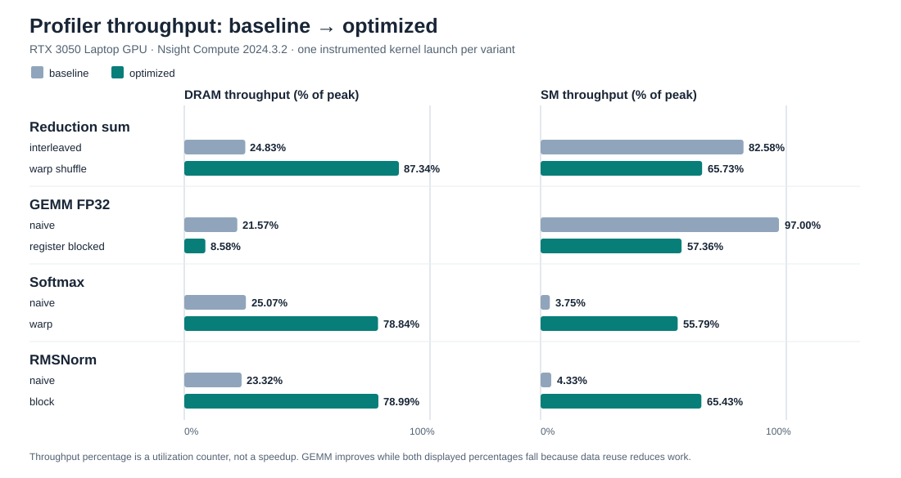

# Stage 11: profiler-backed performance analysis

## Scope and evidence boundary

This is a retrospective analysis of the already-correct optimization ladders and the Stage 9 MiniInfer block. Stage 11 made **no CUDA source change**: each “change” below identifies the earlier baseline-to-optimized implementation difference, not a newly tuned kernel. All source and report binaries match clean implementation commit `f637452`; 31 Release CTests passed before benchmarks, and the Stage 11 reduction, GEMM, and Transformer result validators pass. The deterministic seed is `2027`. Report latencies are uninstrumented CUDA-event measurements with 50 warmups and 500 stored samples per case. Nsight Compute durations are one instrumented launch, while Nsight Systems times describe a traced execution and must not be compared as interchangeable latency estimates.

The machine is an RTX 3050 Laptop GPU, CC 8.6, 4 GB VRAM, Windows, CUDA Toolkit 12.6.85, Nsight Compute 2024.3.2, and Nsight Systems 2025.6.3. Clocks were not locked. NCU performance-counter access needed an elevated process (`ERR_NVGPUCTRPERM` otherwise); no system-wide counter setting was changed. Exact capture/export commands and compact [NCU](../../benchmarks/profiles/stage11/ncu_summary.csv) and [NSYS](../../benchmarks/profiles/stage11/nsys_steady_state.csv) data are in [the reproducibility note](../../benchmarks/profiles/stage11/README.md). Large raw reports stay in ignored `build/profiles/stage11/`.

## Report timings and correctness

| Workload | Baseline median / p95 | Optimized median / p95 | Median speedup | Validation |
| --- | ---: | ---: | ---: | --- |
| FP32 sum, 16,777,216 elements, all passes | interleaved 0.991232 / 1.331200 ms | warp shuffle 0.365536 / 0.381960 ms | 2.712× | Both pass double-accumulation CPU reference; worst absolute error 0.000100732 |
| FP32 GEMM, 1024³ | naive 4.901888 / 5.020711 ms | register blocked 1.118208 / 1.137669 ms | 4.384× | Both pass cuBLAS comparison; optimized max absolute error 0.000020027 |
| FP32 Softmax, 4096 × 1024 | naive 1.090448 / 1.282888 ms | warp 0.196608 / 0.199398 ms | 5.546× | Both pass CPU reference; optimized max absolute error 5.59e-9 |
| FP32 RMSNorm, 4096 × 1024 | naive 0.882688 / 0.906291 ms | block 0.197632 / 0.203781 ms | 4.466× | Both pass CPU reference; optimized max absolute error 4.77e-7 |

The 1024³ FP32 cuBLAS median is 0.578512 ms; register-blocked custom GEMM is 51.74% of cuBLAS throughput, not a cuBLAS win. The sum ladder’s intermediate variants, maximum reduction, FP16 GEMM experiments, and other Transformer kernels remain in the committed result JSON/CSV. Each reported speedup compares two uninstrumented medians at the same shape. The reduction timing covers all passes; NCU below captures only the first pass.

## Reduction: barrier/predication cost becomes DRAM pressure

**Baseline → evidence.** Interleaved sum reads one input per thread and synchronizes every tree level. NCU reports a 65,536-block first pass, 1,024 B dynamic shared memory per block, 8.65 barrier-stall cycles per issued instruction, only 18.16 not-predicated-off threads per warp on average, 38.95 GB/s DRAM bandwidth, and 24.83% DRAM peak. Its 2,095.040 µs instrumented first pass is distinct from the 0.991232 ms full-reduction report median.

**Bottleneck → hypothesis → change.** The evidence supports synchronization/predicated-work and low memory utilization as the baseline bottlenecks, not an FP32 arithmetic limit. Earlier ladder steps first doubled input work per thread and eliminated a pass, then unrolled the shared tree, then replaced most shared-memory exchange with warp shuffles. The final first-pass grid has 32,768 blocks and uses 32 B dynamic shared memory per block.

**New metrics → correctness → conclusion.** Warp shuffle reduces barrier stalls to 2.57 cycles per issue and reaches 170.71 GB/s, 87.34% of reported DRAM peak. Its instrumented first pass is 401.440 µs. The new dominant stall is long scoreboard (14.83 cycles per issue), consistent with waiting on memory after removing much of the barrier cost. All five sum variants and the matching maximum variants pass; the final sum error is 0.000100732. The optimized first pass is now predominantly memory-bandwidth-constrained on this shape. Occupancy falls from 90.00% to 74.39%, which shows that occupancy alone was not the right objective.

## GEMM: load/store issue saturation, then L1/data movement

**Baseline → evidence.** One-thread/one-output naive GEMM repeatedly accesses A and B inside the K loop. NCU shows 97.00% SM throughput, but its load/store instruction pipe is also at 97.00%, DRAM only 21.57% of peak, and FFMA issue only 123.97 thread instructions/cycle versus the 2,048 theoretical roofline metric. Long-scoreboard and LG-throttle stalls are 12.93 and 8.03 cycles per issue. High aggregate “SM throughput” therefore does **not** mean the FP32 arithmetic units are saturated. Its instrumented duration is 7,405.888 µs.

**Bottleneck → hypothesis → change.** Reuse A/B values instead of issuing redundant global loads for every multiply-add. The prior ladder progressed through shared tiling and coalesced loads to a 64 × 64 output tile with per-thread 4 × 4 register accumulators. This raises registers from 34 to 56 per thread and uses 8,512 B static shared memory per block, a deliberate occupancy tradeoff.

**New metrics → correctness → conclusion.** Register blocking reaches 579.59 FFMA thread instructions/cycle, 54.21% load/store pipe utilization, 8.58% DRAM peak, 66.42% achieved occupancy, and 1,503.232 µs instrumented duration. The uninstrumented median improves 4.384× and validation passes. NCU still finds 68.91% L1/data-pipe throughput and 4.33 long-scoreboard stall cycles per issue. This supports a residual L1/data-movement bottleneck rather than a claim of DRAM- or peak-FP32-compute saturation. The 1.118208 ms median remains 1.93× the cuBLAS FP32 median at this shape; further custom-GEMM tuning needs an explicit benefit case.

## Softmax: more parallel rows, then memory throughput

**Baseline → evidence.** The naive kernel assigns one thread to a row and serially scans its 1,024 elements for max, sum, and output. NCU reports 16.57% achieved occupancy, 3.75% SM throughput, 25.07% DRAM peak, and 49.52 long-scoreboard stall cycles per issue. The grid has only about 0.17 full waves per SM. This is insufficient available parallel work and long dependent row loops, not proof that `expf` throughput is limiting.

**Bottleneck → hypothesis → change.** Distribute each row across a block, use warp-shuffle reductions to combine local max/sum, and use a small shared cross-warp handoff. The Stage 6 warp variant is the measured change.

**New metrics → correctness → conclusion.** Occupancy becomes 94.71%, DRAM throughput 78.84% of peak (154.08 GB/s), and long-scoreboard stalls fall to 9.93 cycles per issue. The NCU launch takes 218.048 µs; the uninstrumented report median is 0.196608 ms, 5.546× faster than naive. Both pass reference checks. At this shape, the optimized kernel is primarily memory-throughput-constrained; barriers and exponential work remain but are not established as the leading limit by these counters.

## RMSNorm: serial row work becomes a bandwidth-heavy block

**Baseline → evidence.** One thread reduces and normalizes a whole row. NCU reports 16.50% achieved occupancy, 4.33% SM throughput, 23.32% DRAM peak, and 103.81 long-scoreboard stall cycles per issue. Like naive Softmax, the grid is only about 0.17 full waves per SM.

**Bottleneck → hypothesis → change.** Stage 6 assigned one block per row with distributed FP32 square accumulation and a shared-memory reduction, retaining the same epsilon and row semantics.

**New metrics → correctness → conclusion.** Achieved occupancy rises to 93.36%, DRAM throughput to 78.99% of peak (154.32 GB/s), and long-scoreboard stalls drop to 11.65 cycles per issue. The NCU launch is 217.216 µs. The uninstrumented median improves 4.466× to 0.197632 ms, with maximum absolute error 4.77e-7 and zero failures. The optimized report shape is principally memory-throughput-constrained; the naive shape was limited by serial row work and insufficient grid parallelism.

## MiniInfer system timeline

Nsight Systems traced the full deterministic FP32 block with 3 warmups and 5 measured iterations for each GEMM backend. The whole capture also contains fixture setup and validation, so the table isolates the **last five complete steady-state H2D → forward → D2H passes**. Each pass copies 0.262 MB H2D and D2H, uses one CUDA stream (13), and has no overlapping GPU operations. Times below are medians across those five traced passes; they include profiler overhead and are not the uninstrumented Stage 10 end-to-end medians.

| Backend | GPU span | Kernel work | Copies | GPU idle gaps | CPU H2D-API-start → D2H-API-end | Launches/pass |
| --- | ---: | ---: | ---: | ---: | ---: | ---: |
| custom GEMM | 1,788.283 µs | 1,627.707 µs | 59.264 µs | 101.983 µs | 1,844.788 µs | 18 |
| cuBLAS GEMM | 1,049.532 µs | 884.349 µs | 66.240 µs | 99.167 µs | 1,100.862 µs | 23 |

Across the five selected passes, the custom path’s register-blocked projection kernels have median 1,109.532 µs and median 68.2% of kernel work; attention scores have median 371.615 µs and 22.9%. In the cuBLAS path, attention scores have median 371.519 µs and 42.0% of kernel work. Seven cuBLAS GEMMs plus five split-K reduction kernels have median 363.199 µs and 41.1%. The score kernel is therefore the leading *time contributor* after choosing cuBLAS, but this NSYS trace alone does not establish whether it is memory-, compute-, or synchronization-bound.

The steady-state per-launch CUDA API median is 5.35 µs custom and 5.52 µs cuBLAS. CUDA API H2D/D2H calls on pageable host memory account for much of the host span because the D2H call can wait for earlier queued GPU work; its API duration cannot be labeled “copy overhead.” A `cudaStreamSynchronize` follows each D2H, taking a median 4.89 µs custom and 6.25 µs cuBLAS in the trace. Setup-only calls (stream creation, library loading, allocation) occur outside the five selected passes and must not be charged to steady-state inference. GPU gaps are about 100 µs per pass, but this trace does not isolate how much comes from host dispatch, library calls, scheduling, or synchronization. Since all operations are on one stream, no copy/compute overlap occurs in this block.

Uninstrumented Stage 10 medians remain the appropriate product-level comparison: 1.350656 ms custom versus 0.746400 ms cuBLAS device-resident; 1.512300 ms versus 0.899000 ms transfer-inclusive. The traced pass spans are higher and cannot be substituted for those results.

## Remaining bottlenecks and next questions

- The custom MiniInfer path spends most kernel time in projection GEMMs. The standalone 1024³ register-blocked profile implicates L1/data movement, but MiniInfer’s smaller GEMM shapes were **not** separately profiled, so that specific classification cannot be transferred automatically.
- Attention-score computation becomes the largest cuBLAS-path kernel-time contributor. Profile that exact kernel and shape before proposing tiling or a fused attention algorithm; the current timeline provides time share, not a root-cause counter diagnosis.
- The one-stream, pageable-buffer H2D → kernel sequence → D2H has no overlap and has visible GPU gaps. A controlled pinned-buffer/graph/launch experiment would be needed to attribute or remove them; Stage 7’s two-stream trial did not overlap on this machine.
- Optimized reduction, Softmax, and RMSNorm are close to this device’s measured DRAM-throughput ceiling for their report shapes. Further instruction-level changes should be justified by a new controlled measurement, not assumed from occupancy or source inspection.
- These classifications are bounded to one GPU, driver/toolchain, fixed shapes, unlocked clocks, and the shown timing boundaries. They are not cross-device predictions.
